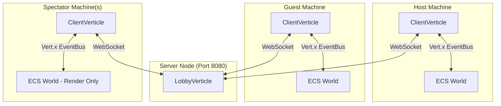
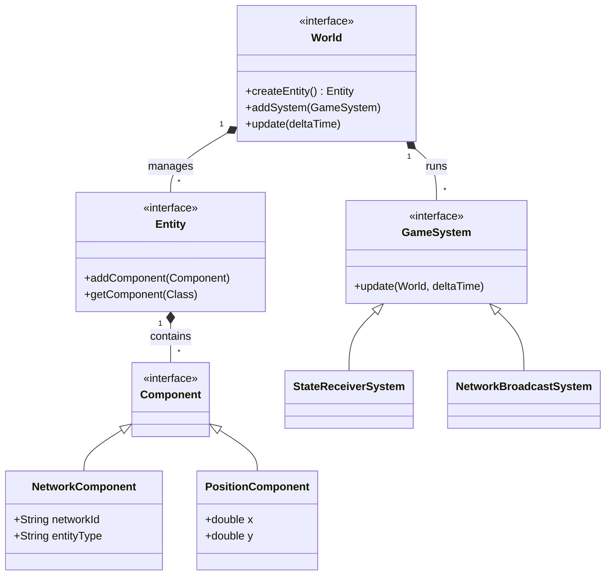
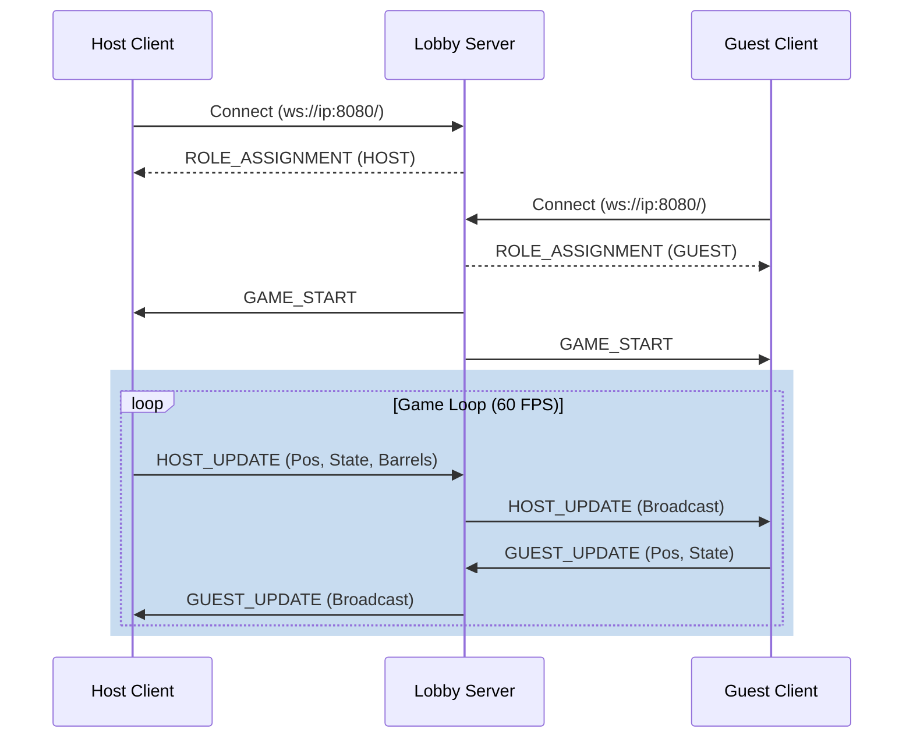
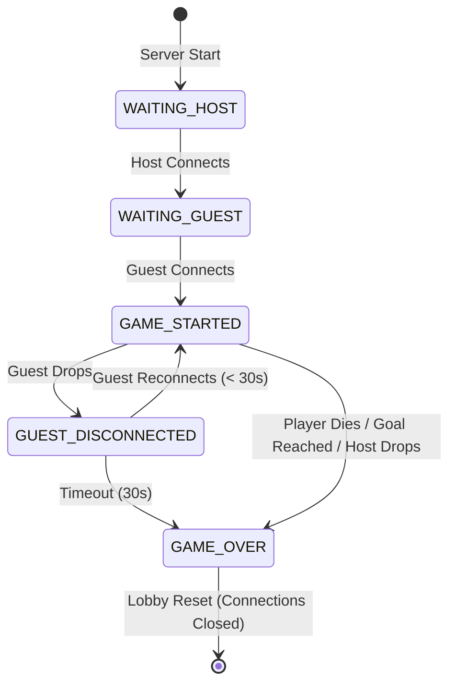

# Donkey Kong: Rush

- [Foschi Giacomo](mailto:giacomo.foschi3@studio.unibo.it)
- [Terenzi Mirco](mailto:mirco.terenzi@studio.unibo.it)

### AI Disclaimer

During the preparation of this work, the authors used GitHub Copilot and DeepL to assist with writing the Javadoc and to
check the grammar of this report. Moreover, Copilot has been used as a review tool in some pull requests on GitHub.
After using this tool/service, the authors reviewed and edited the content as needed and take(s) full responsibility
for the content of the final report/artifact.

## Abstract

This report presents the "Donkey Kong: Rush" project, realized for the "Distributed System" course at the University of
Bologna. The project involves the development of a 2D multiplayer platform video game inspired by the
classic [Donkey Kong](https://en.wikipedia.org/wiki/Donkey_Kong_(1981_video_game)). The system is designed around an
Entity-Component-System (ECS) architecture written in Java, utilizing JavaFX for rendering. The main focus of the
project is the implementation of smooth multiplayer gameplay. The solution combines the Host's authority over the
deterministic environment with a reactive handling of local inputs, guaranteeing an experience free of blocking lag for
the players.

## 1. Concept

"Donkey Kong: Rush" is a desktop application featuring a graphical user interface (GUI). Specifically, it is a 2D
multiplayer platform video game, which takes inspiration from the
original [Donkey Kong](https://en.wikipedia.org/wiki/Donkey_Kong_(1981_video_game)) arcade game.

### 1.1 Use case description

The software provides a competitive multiplayer platforming experience. Users are located on separate desktop machines
connected over the same local area network. Thus, distribution is a fundamental requirement for this project to enable a
seamless multiplayer experience, as it allows players on physically separate machines across a network to connect,
interact, and share the same virtual space.

Interaction is continuous and in real-time during an active game session. The system captures inputs and exchanges state
updates across the network multiple times per second to maintain synchronization.

Players interact with the system via the GUI during setup or keyboard controls during the game. The game controls
consist of standard keybindings for movement (left/right, climbing ladders) and jumping.

The system does not require persistent, long-term data storage. All necessary data represents the state of the ongoing
match (such as player and barrel coordinates) and is kept strictly in RAM.

The game relies on multiple user roles:

- **Host (Player)**: Actively plays the game, processes their own local input, and acts as the local server. It
  possesses authority over the game environment (e.g., generating barrels) and broadcasts the world state to all
  connected clients.
- **Guest (Player)**: Actively plays the game by processing their own input locally while simultaneously receiving
  continuous updates from the Host regarding the rest of the world state.
- **Spectator**: A purely passive role that does not generate game input, but solely receives updates from the players
  to feed its local rendering system, allowing another user to watch the match in real-time.

### 2. Requirements Elicitation and Analysis

##### Glossary

| Term          | Definition                                                                                                                                                                    |
|---------------|-------------------------------------------------------------------------------------------------------------------------------------------------------------------------------|
| **Host**      | A player who actively plays the game, processes local input, acts as the authoritative entity for game-world generation (e.g., barrels), and broadcasts the state to clients. |
| **Guest**     | A player who actively plays the game, processes local input, and receives continuous world state updates from the Host.                                                       |
| **Spectator** | A passive user who does not generate input but receives real-time updates to render and watch the match.                                                                      |
| **Lobby**     | The pre-game networking state where users connect and are assigned their respective roles (Host, Guest, or Spectator) before the match begins.                                |
| **Entity**    | Any distinct object in the game world.                                                                                                                                        |
| **Barrel**    | A dynamic entity that deals damage when a player comes into contact with it.                                                                                                  |
| **Ladder**    | A climbable entity in the game level that enables players to move vertically regardless of gravity.                                                                           |

##### Functional Requirements

| Description                                                                                                                                     | Acceptance Criterion                                                                                                                              |
|-------------------------------------------------------------------------------------------------------------------------------------------------|---------------------------------------------------------------------------------------------------------------------------------------------------|
| The system must allow users to join a lobby and automatically assign them a role (Host, Guest, or Spectator) based on join order or preference. | A user successfully connects to the server and receives a distinct role assignment (Host, Guest, or Spectator) before the game starts.            |
| The system must allow active players to move horizontally (left/right), jump, and climb ladders.                                                | Pressing the designated keys updates the player's position appropriately on the screen according to game physics (gravity, collision).            |
| The system must synchronize the game state (entities positions, and lives) between all connected clients in real time.                          | When the Host moves or a barrel spawns, the Guest and Spectators see the updated positions on their screens without noticeable desynchronization. |
| The system must detect collisions between players and damaging entities (e.g., barrels), deducting a life upon impact.                          | When a player's character intersects with a barrel, the player's life count decreases by 1, and the character respawns at the starting position.  |
| The system must declare a winner if a player reaches the goal (Pauline) or declare a loser if a player's lives reach zero.                      | The game transitions to a "Game Over" screen displaying the correct winner or loser when the goal is touched or 3 lives are lost.                 ||

##### Non-Functional Requirements

These requirements define the behavioral aspects and quality attributes of the system.

| Description                                                                                  | Acceptance Criterion                                                                                                                                                                                                                                                                      |
|----------------------------------------------------------------------------------------------|-------------------------------------------------------------------------------------------------------------------------------------------------------------------------------------------------------------------------------------------------------------------------------------------|
| The game must update and render at a consistent frame rate to ensure smooth gameplay.        | The local game loop executes consistently at the target of 60 Frames-Per-Second (FPS).                                                                                                                                                                                                    |
| State updates must be transmitted rapidly to prevent visual stuttering or unfair advantages. | State update payloads are serialized, transmitted over the local network, and deserialized by the receiving client in under 33 milliseconds (roughly 2 frames).                                                                                                                           |
| The system must ensure automatic recovery from disconnections for non-Host users.            | If a Guest or Spectator loses their network connection and subsequently reconnects to the server while the match is still active, the system automatically restores their role and resumes sending them real-time game state updates without requiring a full lobby reset.                |
| Code must be modular and documented to make extensions and changes easy.                     | Modularity is enforced by strictly decoupling data structures from execution logic, avoiding deep and rigid inheritance trees. Maintainability is verified by the presence of comprehensive Javadoc comments on all core API interfaces, ensuring new features can be integrated rapidly. |

### 2.1 Relevant Distributed System Features

* **Performance, concurrency, and communication efficiency:** Real-time games require extremely strict throughput and
  response times. The system must process player inputs, update physics, and broadcast network messages concurrently
  without blocking the main application thread. High communication efficiency is paramount to ensure state updates are
  delivered within the 33ms latency threshold to maintain a fair 60 FPS gameplay experience.

* **Evolvability and maintainability:** To ensure long-term maintainability and ease of updates, the system's
  architecture must strictly decouple game state data from execution logic. The design must allow new game mechanics or
  virtual objects to be added modularly, actively avoiding rigid, monolithic class hierarchies.

* **Fault tolerance, dependability, and availability:** While data integrity for long-term storage is irrelevant since
  all match state is kept in volatile memory, the system must gracefully handle network faults. If a player's connection
  drops, the central server must detect the failure and immediately broadcast a game-over message, resetting the lobby
  to prevent deadlocks and ensure continued availability for future matches.

* **Resource sharing:** The active game world acts as a synchronized shared resource. The Host is responsible for
  managing authoritative game mechanics and synchronizing this shared state with the Guest and Spectators via continuous
  network message broadcasts.

* **Transparency:** The system provides basic *location transparency*; clients seamlessly connect to the lobby without
  needing to know the physical network topology of the other players. However, *failure transparency* is intentionally
  absent; if a connection drops, the failure is explicitly exposed to the remaining users via the game over UI.

* **Scalability:** The game is explicitly bounded to a small, finite number of simultaneous connections (one Host, one
  Guest, and passive Spectators) on a local area network. It is not expected to scale horizontally to thousands of users
  or handle massive data growth over time.

* **Security and trust:** As a local LAN game without persistent user accounts or sensitive data storage, there is no
  need for cryptographic schemes, data encryption, or complex authentication mechanisms.

* **Openness and interoperability:** The project is a closed ecosystem. While it utilizes standardized text formats for
  message passing, it is not required to interact with external third-party systems or heterogeneous technological
  components.

* **Economy and costs:** Developed as an academic project running on local hardware, there are no cloud deployment
  budgets, operational costs, or strict economic constraints driving the architecture.

## Design

This chapter explains the strategies used to meet the requirements identified in the analysis.

### Architecture

The project follows the Model-View-Controller (MVC) and Entity-Component-System (ECS) architectural patterns. The MVC
pattern is used to separate the user interface from the game logic, while the ECS pattern is used to manage the game
entities and their behaviors.

For what concerns the distributed aspect of the project, a client-server architecture is used. The host player act as
both the client and the server, while the other player and any spectators act as clients. The server is responsible for
managing the game state and broadcasting updates to all connected clients.

This architecture was selected for its simplicity, efficiency, low latency, and ability to abstract complexity from the
user. A decentralized peer-to-peer alternative, where each user operates an interconnected server, was evaluated but
rejected due to high implementation complexity and network latency overhead. Its sole advantage, mitigating the single
point of failure if a central leader goes offline, did not justify the operational trade-offs.

## 3 Design

This section details the architectural and structural decisions made to fulfill the system's requirements.

### 3.1 Architecture

The project follows the Model-View-Controller (MVC) and Entity-Component-System (ECS) architectural patterns. The MVC
pattern is used to separate the User Interface (UI) from the game logic, while the ECS pattern is used to manage the
game entities and their behaviors.

Regarding its distributed nature, the system utilizes a centralized **Client-Server architecture** heavily reliant on an
Event-Driven model. The server acts as a central authoritative game lobby and message relay, while the clients maintain
local instances of the game. This design minimizes peer-to-peer connection issues and provides a single source of truth
for matchmaking, role assignment, and fault management.

### 3.2 Infrastructure

To support the game's multiplayer requirements, the infrastructure relies on a centralized star topology where all
network traffic flows through the main server.

* **Infrastructural Components:**
  * **Game Server (`LobbyVerticle`):** A single server component responsible for accepting connections, storing the
    active socket states (one `hostSocket`, one `guestSocket`, and a list of `spectators`), and brokering messages.
  * **Clients (`ClientVerticle`):** Instances running on the players' local machines that establish a `WebSocketClient`
    connection to the server.
* **Network Distribution:**
  * The server is deployed on a machine accessible to all players, acting as the central node. It exposes its services
    over a single TCP port, listening on port 8080.
  * Clients are distributed edge nodes that do not communicate directly with one another. When the Host acts and
    generates a `HostUpdateMessage`, it sends the data (including player coordinates, state, lives, and barrel data) to
    the server, which then mirrors this data to the Guest and all Spectators.
* **Component Discovery and Addressing:**
  * Clients discover and connect to the server using a predetermined IP address (`hostIp`) and port (`8080`), configured
    upon client initialization.
  * Role-based addressing is handled via endpoint paths and connection order. Standard players connect to the root path,
    where the server automatically assigns the `HOST` role to the first connection and the `GUEST` role to the second.
    Observers use a distinct discovery mechanism by connecting to the specific URI path `/spectate`, which routes them
    directly into the server's `spectators` pool.

### 3.3 Modelling

- **Domain Entities:** In "Donkey Kong: Rush", the primary domain entities are the `World` (the container of the game state), the `Player` (representing either the Host or Guest avatars), the `Barrel` (dynamic obstacles), and static elements like `Ladder` and `Platform`.
- **Mapping to Infrastructural Components:** The system employs a replicated state model rather than a pure thin-client approach. Both the `LobbyVerticle` (Server) and the `ClientVerticle` (Clients) maintain representations of the game state.
  - The Server acts as a stateless message broker; it does not simulate physics but relies on the Host's computational authority.
  - The Clients hold the actual state of the game within their local `WorldImpl` instance, processing physics and rendering the GUI. The Host generates authoritative data (e.g., barrel spawns) and maps this to the Server via events.
- **Domain Events:** Core events include `GAME_START` (which initializes the simulation on all nodes), `HOST_UPDATE` (transmitting the Host's position and global entity data), `GUEST_UPDATE` (transmitting the Guest's position), and terminal events like `GOAL_REACHED`, `PLAYER_DIED`, or `GUEST_DISCONNECTED`.
- **Messages Exchanged:** The system relies primarily on state-update messages rather than pure command messages. Instead of sending discrete inputs (e.g., "Player moved left"), clients exchange high-frequency serialized snapshots of their entities (e.g., "Player X is at coordinate Y with state MOVING").
- **System State:** The distributed state encompasses the positional coordinates, state machines (e.g., jumping, falling, idle), facing directions, and remaining lives of the connected players, alongside the active network IDs and positional coordinates of all dynamic barrels in the arena.

### 3.4 Interaction

- **Communication Channels:** Components communicate bidirectionally using a persistent `WebSocket` connection. The `ClientVerticle` pushes messages onto the local Vert.x `EventBus`, which are then transmitted over the network to the `LobbyVerticle`. The Server broadcasts these messages back to the appropriate endpoints (either to the opposing player or to all Spectators).
- **Timing and Frequency:** Interaction is continuous. State update messages (`HostUpdateMessage` and `GuestUpdateMessage`) are fired iteratively during the `GameLoop` (running at a target of 60 frames per second). Event-triggered messages (like `ENTITY_DESTROYED`) are communicated asynchronously only when a specific collision resolves locally.
- **Interaction Patterns:** The system enacts a **Publish-Subscribe / Broadcast pattern** mediated by the Server. The Host publishes the state of the authoritative world, to which Guests and Spectators are inherently subscribed. Concurrently, it implements a **Client-Server RPC-like pattern** for matchmaking, where the client explicitly requests a connection and waits for the server to reply with a `ROLE_ASSIGNMENT`.

### 3.5 Behaviour

- **Individual Component Behavior:**
  - The **Host Client** is highly stateful and authoritative. It responds to local keyboard events by updating its own physics and spawning barrels on an internal timer (`SpawnSystem`). It then blindly pushes this definitive state outwards.
  - The **Guest Client** is stateful but semi-authoritative. It computes its own player physics independently in response to local keyboard events, but acts purely reactively regarding barrels, spawning or removing them locally only when instructed by a `HOST_UPDATE` message via the `StateReceiverSystem`.
  - The **Spectator Client** is passive and purely reactive. It does not update the `World` based on elapsed time (`deltaTime`), but strictly overwrites entity positions based on incoming network messages to render the current frame.
- **State Updating Mechanism:** The state is updated continuously via the ECS architecture. During each frame of the `AnimationTimer`, the `WorldImpl.update()` method iterates through all active `GameSystem`s (e.g., `MovementSystem`, `PhysicsSystem`). The `StateReceiverSystem` is explicitly in charge of capturing incoming network updates from the Vert.x `EventBus` and applying those external coordinate changes to the local entities before the next render cycle.

### 3.6 Data and Consistency Issues

- **Transient Storage:** The system does not utilize persistent data storage (e.g., SQL, NoSQL, or key-value databases). All data generated during a session—such as entity coordinates, physical velocities, and life counts—represents the active, ephemeral game state. This data is stored exclusively in volatile memory (RAM) within the `WorldImpl` instance of each client. This architecture strictly reflects the session-based arcade nature of the game, which deliberately lacks user accounts, persistent leaderboards, or save files.
- **Database Queries:** As there is no persistent storage layer, there are no database queries, concurrent database reads/writes, or transactional locks to manage.
- **Shared Data:** The physical state of the game world is highly shared among all distributed components. The Host actively shares the coordinates of its avatar and all dynamic environmental entities (barrels). The Guest shares its local avatar's coordinates. Spectators share no data but receive all shared state.
- **Consistency Model:** The game relies on a **continuous state-replication** model rather than strict transactional consensus. The Host is the definitive source of truth for the game environment, while the Guest acts as the source of truth for its own movement. Consistency is maintained through high-frequency network broadcasts (running at the target 60 FPS). In the event of network latency, a client's local `MovementSystem` will predictively extrapolate entity positions. However, incoming network messages will forcefully correct and overwrite these local predictions with the authoritative coordinates, ensuring eventual consistency without the overhead of distributed locks.

### 3.7 Fault-Tolerance

- **Data Replication and Sharing:** The system's architecture inherently relies on a continuous state-replication mechanism to maintain synchronization across the network. The ephemeral game state (encapsulated within the ECS `World` instance) is actively replicated across all connected nodes rather than federated. The Host serves as the definitive source of truth, replicating the state of dynamic entities (such as barrels) and its own avatar to both the Guest and Spectators. Simultaneously, the Guest shares its local avatar's coordinates, which are replicated back to the Host. Spectators maintain a read-only replicated state, ensuring their local simulation mirrors the active game without interfering with it.
- **Heart-beating, Timeout, and Retry Mechanism:** To handle transient network instability (e.g., temporary Wi-Fi drops on a local area network), the central `LobbyVerticle` implements a dedicated timeout and retry mechanism specifically tailored for the Guest connection. If the Guest's WebSocket closes unexpectedly while the game is active, the server does not immediately terminate the match. Instead, it pauses active event broadcasting for that node and initiates a 30-second timer (`guestReconnectTimerId`). If the Guest successfully reconnects within this 30-second window, the server transmits a specific payload (`isReconnect: true`), and the Host replies with a `RESTORE_STATE` message containing the exact coordinates and lives count of the Guest just before the drop, seamlessly resuming the game. If the timeout expires without a successful reconnection, the server declares a `GUEST_TIMEOUT` and resolves the match in favor of the Host.
- **Error Handling and Component Failure:** The system relies on event-driven error handling to prevent deadlocks and ghost sessions:
  - **Host Failure:** Since the Host holds the authoritative state of the game world, a sudden disconnection of the Host's socket is unrecoverable. The server detects the closure, immediately broadcasts a `GAME_OVER` message (with the reason `HOST_DISCONNECTED`) to the Guest and Spectators, and flushes the lobby state, reopening port connections for a brand-new match.
  - **Spectator Failure:** The system enforces strict isolation for passive observers. If a Spectator disconnects or crashes, the server simply evicts their socket from the internal `spectators` array. This failure is completely transparent to the active players and does not impact the game loop or the server's stability.

### 3.8 Availability

- **Caching Mechanism:** Traditional distributed data caching (e.g., Memcached or Redis) is not utilized because the game state is highly volatile, changing every 16 milliseconds to maintain a 60 FPS target. However, at the local client level, a strict asset caching mechanism is implemented within the `RenderingSystem`. Visual resources are loaded and sliced into sprite sheet frames only once upon initialization and stored in local memory (`assetCache` and `sourceImageCache`). This prevents continuous disk I/O operations and memory reallocation during the intensive rendering loop, ensuring the client remains highly responsive and visually available.
- **Load Balancing:** Load balancing is neither implemented nor required for this specific architecture. The system's scope is strictly bounded to a local area network supporting a single active game session per server instance (hardcoded to one Host, one Guest, and a passive array of Spectators). If the system were to be scaled for a wider internet deployment (e.g., a matchmaking hub hosting hundreds of concurrent Donkey Kong arenas), a reverse proxy (like Nginx) or a dedicated matchmaking service would be necessary to dynamically balance incoming WebSocket connections across multiple horizontally scaled `LobbyVerticle` worker nodes.
- **Network Partitioning:** In the context of the CAP theorem, the system deliberately prioritizes **Consistency (C)** over **Availability (A)** during a network partition. If a partition isolates the Guest from the Server, local gameplay cannot proceed independently, as a desynchronized competitive platformer would result in unfair and invalid states (e.g., a player passing through a barrel on their screen, but being hit on the opponent's screen). The server handles the partition by enforcing a hard pause on state updates via the aforementioned 30-second fault-tolerance window. If the partition cannot be resolved within this timeframe, the server destroys the active game session to become available again for new, healthy connections.

### 3.9 Security

- **Authentication:** The system does not implement formal authentication mechanisms such as OAuth 2.0, JWT (JSON Web Tokens), or session cookies. Given the academic, local LAN scope of the project and the intentional absence of persistent user accounts or leaderboards, clients are implicitly trusted simply by successfully establishing a TCP/WebSocket connection to the server's IP address.
- **Authorization:** While formal authentication is absent, a rudimentary form of Role-Based Access Control (RBAC) is enforced by the `LobbyVerticle` through connection routing and temporal ordering. Access rights are rigidly determined by the URI path utilized during the initial handshake:
  - **HOST Role:** Assigned to the first WebSocket connecting to the root `/play` endpoint. This role is granted the highest authorization, including the rights to dictate global game state, spawn barrels, and trigger game-over conditions.
  - **GUEST Role:** Assigned to the second WebSocket connecting to the `/play` endpoint. This role is strictly authorized to broadcast updates regarding its own specific entity (the Guest player avatar) and cannot manipulate the environment. Any attempt by a Guest to spawn a barrel would be ignored by the server's routing logic.
  - **SPECTATOR Role:** Assigned to any WebSocket connecting to the `/spectate` endpoint. This role is granted strictly read-only access. The server pushes updates to these clients but does not listen to or process any state-update messages originating from them.
- **Cryptographic Schemas:** No cryptographic schemas, token verification, or in-transit data encryption protocols are employed. Messages are serialized as plaintext JSON and transmitted over standard, unencrypted WebSockets (`ws://` rather than `wss://`). This is a deliberate architectural trade-off: the game processes no sensitive personal data (PII), financial records, or credentials. Consequently, prioritizing raw throughput and minimal latency over encryption overhead is the optimal choice for a local, real-time multiplayer application.

## 4 Implementation

This chapter details the specific technology-dependent choices made to realize the architectural design, focusing on network protocols, data serialization, and the frameworks exploited.

- **Network Protocols:** The system utilizes **WebSockets (WS) over TCP** for all network communication. While standard HTTP is strictly request-response, WebSockets provide a persistent, full-duplex communication channel. This is absolutely critical for a real-time multiplayer game running at 60 FPS, as the server needs to push state updates continuously to all clients without waiting for explicit requests. While UDP is traditionally used for fast-paced games to avoid TCP's head-of-line blocking, WebSockets were chosen because they provide guaranteed, ordered delivery out-of-the-box, drastically simplifying the implementation for a local area network (LAN) environment where packet loss is negligible.
- **In-transit Data Representation:** All data exchanged over the network is serialized and represented in **JSON (JavaScript Object Notation)**. The payloads are formatted as simple stringified JSON objects containing key-value pairs for coordinates, entity states, and active identifiers (e.g., `{"type": "HOST_UPDATE", "playerX": 10.5, "lives": 3}`). While binary formats like Protocol Buffers (gRPC) would offer smaller payload sizes and faster serialization, JSON was selected for its native integration with the networking framework, its human-readability which greatly sped up debugging, and its sufficient performance over a local network.
- **Database Queries:** As extensively discussed in the Design section, the system does not utilize any persistent storage. Consequently, there are no SQL or NoSQL databases queried, and the application relies entirely on volatile memory (RAM) to manage the game state during runtime.
- **Authentication and Authorization:** The implementation does not utilize standardized authentication protocols (such as OAuth 2.0 or JWT) nor formal authorization frameworks (like ABAC). The system implements a custom, lightweight Role-Based Access Control (RBAC) enforced programmatically by the server based solely on the WebSocket connection endpoint (`/play` vs `/spectate`) and the chronological order of connections.

### 4.1 Technological Details

The project relies on a specific technology stack to achieve its concurrency and rendering goals:

- **Java (JDK 21+):** The entire application is written in Java, taking advantage of modern language features. In particular, Java `record` classes are extensively exploited to define immutable ECS Components (e.g., `PositionComponent`, `VelocityComponent`), ensuring thread safety and reducing boilerplate code.
- **Eclipse Vert.x:** This is the core framework used for networking and concurrency. Vert.x is built on a non-blocking, event-driven architecture (using the Reactor pattern), which allows it to handle multiple concurrent WebSocket connections with minimal thread overhead.
  - The `LobbyVerticle` acts as the HTTP/WebSocket server.
  - The `ClientVerticle` manages the client-side WebSocket.
  - The internal **Vert.x EventBus** is heavily exploited to decouple the network layer from the game logic layer. Incoming network messages are pushed to the EventBus, where the ECS `StateReceiverSystem` consumes them asynchronously, preventing network operations from blocking the main game loop.
- **JavaFX:** Used exclusively for the client-side graphical user interface (GUI) and rendering. The game does not use traditional JavaFX UI controls for the gameplay; instead, it utilizes a raw `Canvas` and a `GraphicsContext` to manually draw and clear sprite sheets frame-by-frame. The core game loop is driven by a JavaFX `AnimationTimer`, which fires the ECS `World.update(deltaTime)` method to process physics and render the graphics concurrently at a targeted 60 FPS.
- **Custom ECS Engine:** Rather than relying on a heavy third-party game engine (like LibGDX), the project implements a custom Entity-Component-System from scratch. This allows for total control over the modularity of the code, separating pure data (`Component`) from execution logic (`GameSystem`), making the implementation of network state synchronization straightforward and predictable.

## 5 Validation

To ensure the reliability, correctness, and performance of the distributed game, the system was subjected to a rigorous testing phase, divided into automated testing for core logic and manual acceptance testing for gameplay feel and GUI responsiveness.

### 5.1 Automatic Testing

Automated testing was implemented using JUnit 5 and managed via the Gradle build tool. The tests are executed automatically within a Continuous Integration (CI) pipeline using GitHub Actions (`ci.yml` and `pr-checks.yml`), ensuring that every pull request is validated before being merged. Tests can be run locally by executing `./gradlew test` via the command line interface.

- **Unit Testing:**
  Individual components, specifically the pure execution logic within the ECS architecture, were strictly unit-tested in isolation.
  - **Rationale:** To verify that game physics, entity interactions, and boundary limitations work deterministically without spinning up the network or the graphical interface.
  - **Implementation:** Tests such as `PhysicsSystemTest`, `GravitySystemTest`, and `MovementSystemTest` initialize a mock `World`, inject entities with specific `Component` sets, manually invoke the system's `update(deltaTime)` method, and assert the resulting state. For example, `BoundariesSystemTest` acts as a corner-case test by placing an entity outside the screen coordinates and asserting that the system clamps its position back within the allowed arena.
  - **Requirements Tested:** Verifies the functional requirements related to horizontal movement, jumping, and collision detection.

- **Integration Testing:**
  Communication and interaction among components, particularly the network layer, were tested using integration tests.
  - **Rationale:** To verify that the Vert.x components correctly bind to ports, handle WebSocket handshakes, route messages through the EventBus, and correctly manage the state machine of the multiplayer lobby.
  - **Implementation:** The `LobbyVerticleTest` and `ClientVerticleTest` utilize `VertxTestContext` to deploy the server and client verticles in a sandboxed, asynchronous test environment. These tests simulate the connection of multiple clients to verify the automatic role assignment (e.g., ensuring the first connection becomes the Host and the second becomes the Guest). Furthermore, `EndGameScenariosTest` and `WinSystemTest` simulate the integration between the collision logic and the network broadcast, asserting that terminal states trigger the correct game-over messages.
  - **Corner Cases Tested:** The tests specifically validate error handling and network partitions, such as simulating a client disconnection to ensure the server gracefully resets or starts the 30-second fault-tolerance timer.

- **End-to-End (E2E) Testing:**
  Fully automated End-to-End testing—spinning up the production server, launching multiple headless JavaFX client instances, simulating network latency, and injecting programmatic keyboard inputs—was deemed out of scope due to the extreme brittleness of automated GUI testing for real-time games. E2E validation was instead covered through manual acceptance testing.

### 5.2 Acceptance Test

Manual testing was a critical phase of the validation process, conducted in a production-like local area network (LAN) environment with multiple physical machines.

- **What was tested:**
  - **UI/UX Flow:** The transition from the Main Menu to the active game, and finally to the Game Over screen.
  - **Network Synchronization:** The visual coherence of the game state between the Host, Guest, and Spectator screens. This involved verifying that barrel spawns and player movements did not suffer from "rubber-banding" or visual desynchronization.
  - **Gameplay Feel:** The responsiveness of the keyboard inputs (jump height, movement speed) and the consistency of the 60 FPS rendering loop.
  - **Fault Recovery:** Physically disconnecting the Wi-Fi on the Guest machine to verify that the game paused, the 30-second timer started on the server, and the state was correctly restored upon reconnection.

- **Why wasn't it automatic?**
  While the mathematical determinism of the physics engine and the routing logic of the network were easily covered by automated unit and integration tests, subjective quality metrics cannot be automatically asserted. The "smoothness" of the JavaFX Canvas rendering, the tactile responsiveness of the controls, and the human perception of network latency require manual observation. Furthermore, automating the disconnection of physical network adapters across distributed machines to test the fault-tolerance window would require a highly complex and fragile infrastructure that exceeds the academic scope of this project.

## Release

- how where components organized into _inter-dependant modules_ or just a single monolith?
  * provide a _dependency graph_ if possible

- were modules distributed as a _single archive_ or _multiple ones_?
  * why?

- how were archive versioned?

- were archive _released_ onto some archive repository (e.g. Maven, PyPI, npm, etc.)?
  * how to _install_ them?

## Deployment

- should one install your software from scratch, how to do it?
  * provide instructions
  * provide expected outcomes

## User Guide

- how to use your software?
  * provide instructions
  * provide expected outcomes
  * provide screenshots if possible

## Self-evaluation

- An individual section is required for each member of the group
- Each member must self-evaluate their work, listing the strengths and weaknesses of the product
- Each member must describe their role within the group as objectively as possible.
  It should be noted that each student is only responsible for their own section
