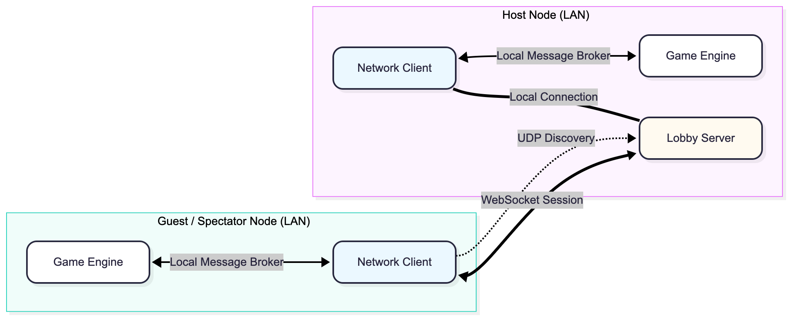
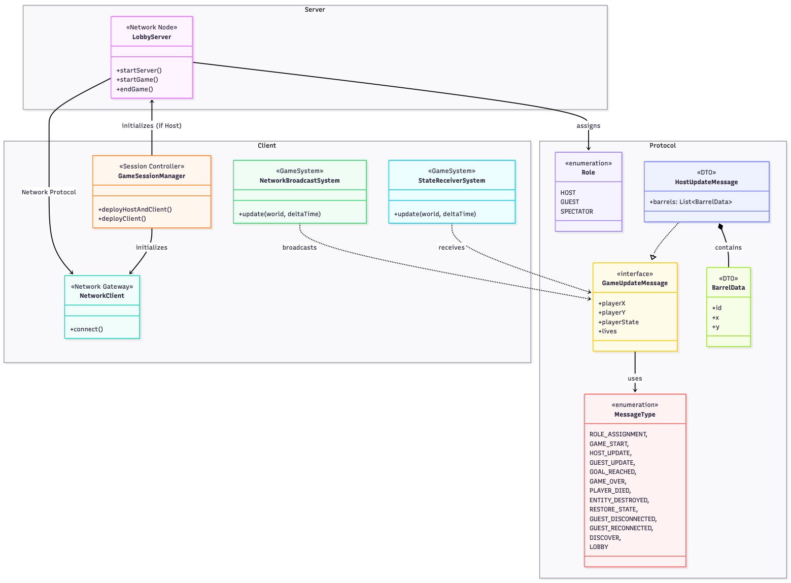
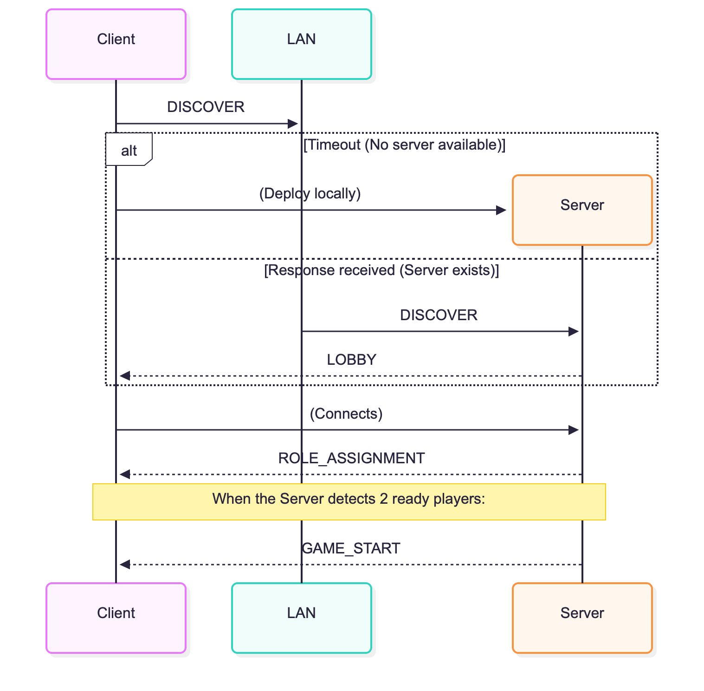
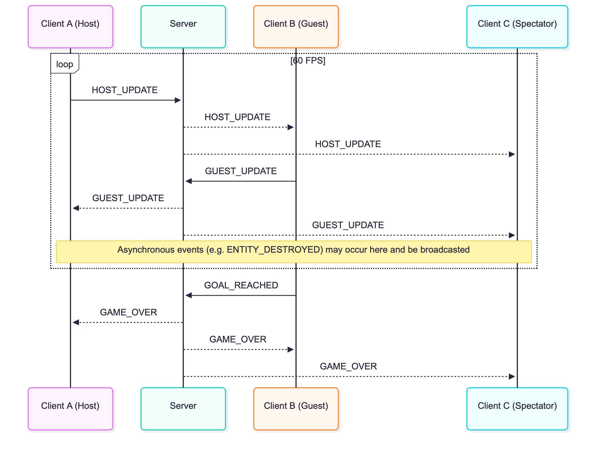
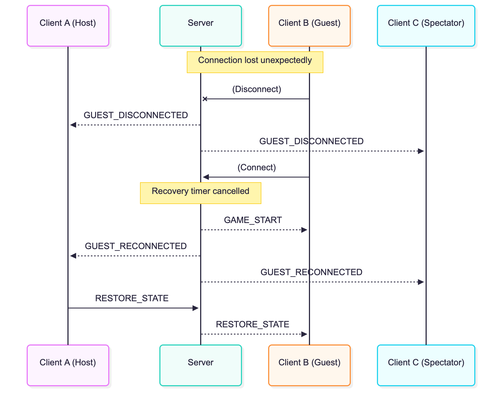
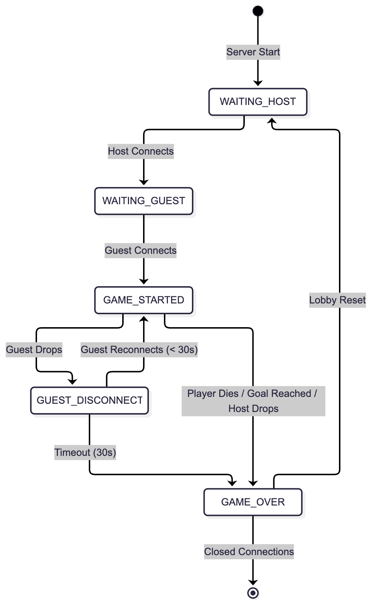
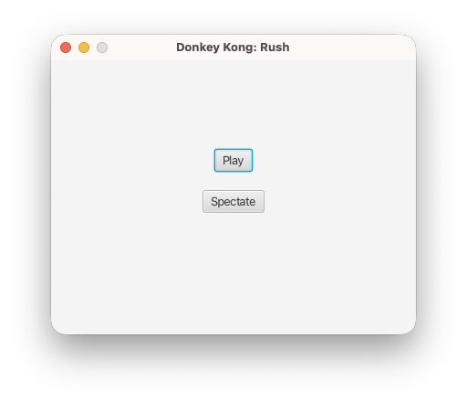
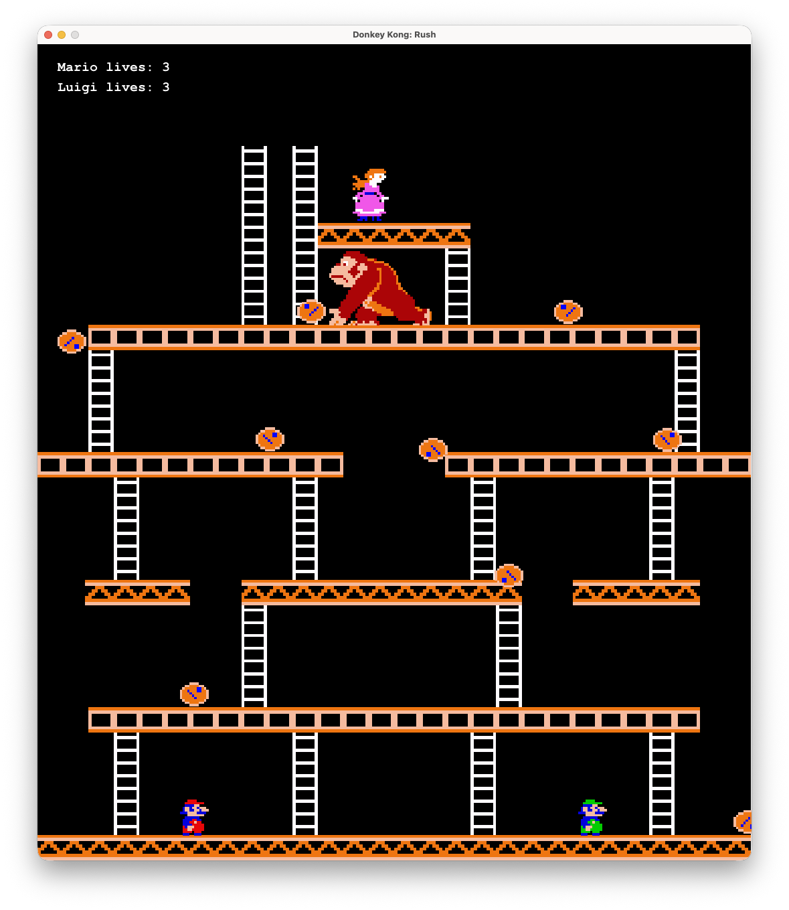

# Donkey Kong: Rush

- [Foschi Giacomo](mailto:giacomo.foschi3@studio.unibo.it)
- [Terenzi Mirco](mailto:mirco.terenzi@studio.unibo.it)

### AI Disclaimer

During the preparation of this work, the authors used GitHub Copilot and DeepL to assist with writing the Javadoc and to
check the grammar of this report. Moreover, Copilot has been used as a review tool in some pull requests on GitHub.
After using this tool/service, the authors reviewed and edited the content as needed and take (s) full responsibility
for the content of the final report/artifact.

## Abstract

This report presents the "Donkey Kong: Rush" project, realized for the "Distributed System" course at the University of
Bologna. The project involves the development of a 2D multiplayer platform video game inspired by the
classic [Donkey Kong](https://en.wikipedia.org/wiki/Donkey_Kong_(1981_video_game)). The system is designed around an
Entity-Component-System (ECS) architecture written in Java, utilizing JavaFX for rendering. The main focus of the
project is the implementation of smooth multiplayer gameplay. The solution combines the Host's authority over the
deterministic environment with a reactive handling of local inputs, guaranteeing an experience free of blocking lag for
the players.

## 1. Concept

"Donkey Kong: Rush" is a desktop application featuring a graphical user interface (GUI). Specifically, it is a 2D
multiplayer platform video game, which takes inspiration from the
original [Donkey Kong](https://en.wikipedia.org/wiki/Donkey_Kong_(1981_video_game)) arcade game.

### 1.1. Use case description

The software provides a competitive multiplayer platforming experience. Users are located on separate desktop machines
connected over the same local area network. Thus, distribution is a fundamental requirement for this project to enable a
seamless multiplayer experience, as it allows players on physically separate machines across a network to connect,
interact, and share the same virtual space.

Interaction is continuous and in real-time during an active game session. The system captures inputs and exchanges state
updates across the network multiple times per second to maintain synchronization.

Players interact with the system via the GUI during setup or keyboard controls during the game. The game controls
consist of standard keybindings for movement (left/right, climbing ladders) and jumping.

The system does not require persistent, long-term data storage. All necessary data represents the state of the ongoing
match (such as player and barrel coordinates) and is kept strictly in RAM.

The game relies on multiple user roles:

- **Host (Player)**: Actively plays the game, processes their own local input, and acts as the local server. It
  possesses authority over the game environment (e.g., generating barrels) and broadcasts the world state to all
  connected clients.
- **Guest (Player)**: Actively plays the game by processing their own input locally while simultaneously receiving
  continuous updates from the Host regarding the rest of the world state.
- **Spectator**: A purely passive role that does not generate game input, but solely receives updates from the players
  to feed its local rendering system, allowing another user to watch the match in real-time.

## 2. Requirements Elicitation and Analysis

#### Glossary

| Term          | Definition                                                                                                                                                                    |
|---------------|-------------------------------------------------------------------------------------------------------------------------------------------------------------------------------|
| **Host**      | A player who actively plays the game, processes local input, acts as the authoritative entity for game-world generation (e.g., barrels), and broadcasts the state to clients. |
| **Guest**     | A player who actively plays the game, processes local input, and receives continuous world state updates from the Host.                                                       |
| **Spectator** | A passive user who does not generate input but receives real-time updates to render and watch the match.                                                                      |
| **Lobby**     | The pre-game networking state where users connect and are assigned their respective roles (Host, Guest, or Spectator) before the match begins.                                |
| **Entity**    | Any distinct object in the game world.                                                                                                                                        |
| **Barrel**    | A dynamic entity that deals damage when a player comes into contact with it.                                                                                                  |
| **Ladder**    | A climbable entity in the game level that enables players to move vertically regardless of gravity.                                                                           |

#### Functional Requirements

| Description                                                                                                                                     | Acceptance Criterion                                                                                                                              |
|-------------------------------------------------------------------------------------------------------------------------------------------------|---------------------------------------------------------------------------------------------------------------------------------------------------|
| The system must allow users to join a lobby and automatically assign them a role (Host, Guest, or Spectator) based on join order or preference. | A user successfully connects to the server and receives a distinct role assignment (Host, Guest, or Spectator) before the game starts.            |
| The system must allow active players to move horizontally (left/right), jump, and climb ladders.                                                | Pressing the designated keys updates the player's position appropriately on the screen according to game physics (gravity, collision).            |
| The system must synchronize the game state (entities positions, and lives) between all connected clients in real time.                          | When the Host moves or a barrel spawns, the Guest and Spectators see the updated positions on their screens without noticeable desynchronization. |
| The system must detect collisions between players and damaging entities (e.g., barrels), deducting a life upon impact.                          | When a player's character intersects with a barrel, the player's life count decreases by 1, and the character respawns at the starting position.  |
| The system must declare a winner if a player reaches the goal (Pauline) or declare a loser if a player's lives reach zero.                      | The game transitions to a "Game Over" screen displaying the correct winner or loser when the goal is touched or 3 lives are lost.                 ||

#### Non-Functional Requirements

These requirements define the behavioral aspects and quality attributes of the system.

| Description                                                                                  | Acceptance Criterion                                                                                                                                                                                                                                                                      |
|----------------------------------------------------------------------------------------------|-------------------------------------------------------------------------------------------------------------------------------------------------------------------------------------------------------------------------------------------------------------------------------------------|
| The game must update and render at a consistent frame rate to ensure smooth gameplay.        | The local game loop executes consistently at the target of 60 Frames-Per-Second (FPS).                                                                                                                                                                                                    |
| State updates must be transmitted rapidly to prevent visual stuttering or unfair advantages. | State update payloads are serialized, transmitted over the local network, and deserialized by the receiving client in under 33 milliseconds (roughly 2 frames).                                                                                                                           |
| The system must ensure automatic recovery from disconnections for non-Host users.            | If a Guest or Spectator loses their network connection and subsequently reconnects to the server while the match is still active, the system automatically restores their role and resumes sending them real-time game state updates without requiring a full lobby reset.                |
| Code must be modular and documented to make extensions and changes easy.                     | Modularity is enforced by strictly decoupling data structures from execution logic, avoiding deep and rigid inheritance trees. Maintainability is verified by the presence of comprehensive Javadoc comments on all core API interfaces, ensuring new features can be integrated rapidly. |

### 2.1 Relevant Distributed System Features

* **Performance, concurrency, and communication efficiency:** Real-time games require extremely strict throughput and
  response times. The system must process player inputs, update physics, and broadcast network messages concurrently
  without blocking the main application thread. High communication efficiency is paramount to ensure state updates are
  delivered within the 33ms latency threshold to maintain a fair 60 FPS gameplay experience.

* **Evolvability and maintainability:** To ensure long-term maintainability and ease of updates, the system's
  architecture must strictly decouple game state data from execution logic. The design must allow new game mechanics or
  virtual objects to be added modularly, actively avoiding rigid, monolithic class hierarchies.

* **Fault tolerance, dependability, and availability:** While data integrity for long-term storage is irrelevant since
  all match state is kept in volatile memory, the system must gracefully handle network faults. If a player's connection
  drops, the central server must detect the failure and immediately broadcast a game-over message, resetting the lobby
  to prevent deadlocks and ensure continued availability for future matches.

* **Resource sharing:** The active game world acts as a synchronized shared resource. The Host is responsible for
  managing authoritative game mechanics and synchronizing this shared state with the Guest and Spectators via continuous
  network message broadcasts.

* **Transparency:** The system provides basic *location transparency*; clients seamlessly connect to the lobby without
  needing to know the physical network topology of the other players. However, *failure transparency* is intentionally
  absent; if a connection drops, the failure is explicitly exposed to the remaining users via the game over UI.

* **Scalability:** The game is explicitly bounded to a small, finite number of simultaneous connections (one Host, one
  Guest, and passive Spectators) on a local area network. It is not expected to scale horizontally to thousands of users
  or handle massive data growth over time.

* **Security and trust:** As a local LAN game without persistent user accounts or sensitive data storage, there is no
  need for cryptographic schemes, data encryption, or complex authentication mechanisms.

* **Openness and interoperability:** The project is a closed ecosystem. While it utilizes standardized text formats for
  message passing, it is not required to interact with external third-party systems or heterogeneous technological
  components.

* **Economy and costs:** Developed as an academic project running on local hardware, there are no cloud deployment
  budgets, operational costs, or strict economic constraints driving the architecture.

## 3. Design

### 3.1. Architecture

The project follows the Model-View-Controller (MVC) and Entity-Component-System (ECS) architectural patterns. The MVC
pattern is used to separate the User Interface (UI) from the game logic, while the ECS pattern is used because it favors
composition over inheritance, providing flexibility to add/remove behaviors (components) and logic loops (systems).

Regarding its distributed nature, the system utilizes an event-driven **Client-Server architecture**. Within this
framework, the project implements a hybrid synchronization model that combines a _leader-follower_ pattern for the
environment with distributed authority for player movement. The session creator acts as the authoritative host for the
game world, holding exclusive control over global state transitions and environmental entities, such as generating and
moving barrels. However, for player characters, the system utilizes client-side authority: each client independently
calculates its own character's movement and actions locally, transmitting these authoritative updates to the other
peers. This design guarantees a consistent world state while completely eliminating input lag for the players.

### 3.2. Infrastructure

To support the game's multiplayer requirements, the infrastructure relies on a centralized star topology where all
network traffic flows through the main server.

#### Infrastructural Components

* **Server:** Exactly one server component is active per game session. It manages the game lobby, handles network
  connections for all participants, assigns roles, and acts as the authoritative source for game state transitions
  (e.g., starting the game, handling disconnections).
* **Clients:** There are multiple client components per session, one for each playing user and spectator. They establish
  a connection to the server to forward outgoing inputs/messages and receive game state updates.
* **Message Broker:** A local event bus acts as an internal message broker on each machine. It decouples the network
  communication layer from the core game logic, routing incoming and outgoing messages between the network handlers and
  the game systems.

#### Network Distribution

The game is designed to be deployed and played over a Local Area Network (LAN) and the network distribution of the
components depends dynamically on the players' roles:

* **Host Machine:** The player who creates the game session acts as the host. Their physical machine runs both the
  central Server component and their own local Client component.
* **Guest/Spectator Machines:** The other participants run only the client component on their respective physical
  machines. These clients connect remotely over the local network to the host's IP address.

Therefore, the infrastructure is entirely localized within the players' shared local network.

#### Service Discovery

Components do not rely on static IP configuration. Instead, they dynamically discover active sessions using a custom
_service discovery_ mechanism based on UDP Broadcasts: when a player attempts to join or spectate a game, their client
broadcasts a UDP discovery request to the entire subnet. The host's server listens for these packets and replies
directly to the sender with the necessary connection details (IP, port, lobby ID, and slot availability).

Moreover, a _conflict resolution_ mechanism handles cases where multiple players attempt to host a lobby simultaneously
on the same network. Lobbies constantly broadcast their presence; if a server detects another active lobby with a higher
priority, it yields its host status, shuts down its server component, and automatically reconnects as a client.



### 3.3. Modelling

#### Domain Entities and Infrastructure Mapping

The domain models the distributed system and its state synchronization through specific entities, which are mapped to
the underlying infrastructure based on a partitioned authority model:

* **Game Session (Lobby)**: The core entity representing the match lifecycle. It resides centrally in the Server's
  memory (`LobbyVerticle`) and maps incoming WebSocket connections to specific network roles (`HOST`, `GUEST`, or
  `SPECTATOR`). It acts as the single source of truth for the game phase and connection fault tolerance.
* **Player Avatars (Mario & Luigi)**: Synchronized game entities. Rather than a fully centralized model, ownership is
  distributed: the Host computes and broadcasts its avatar's physics, while the Guest independently computes and
  broadcasts its own. Remote clients hold a local replica updated via the ECS `StateReceiverSystem`.
* **Dynamic Obstacles (Barrels)**: Authoritative game entities. Their generation and physical simulation reside
  exclusively on the Host's infrastructural loop, which guarantees a single source of truth. The Server relays this
  data, and clients map these entities as read-only visual replicas in their local ECS.
* **Static Environment (Map, Platforms, Ladders)**: Local-only entities. They reside entirely in the clients' memory and
  are deterministically loaded by a factory component at startup, requiring no network synchronization.

#### Distributed System State

The overall state of the application is decoupled into two distinct layers:

* **Session State (Server)**: Maintained by the central lobby component. It comprehends the registry of active WebSocket
  connections, the assigned roles, the current global game phase, and the active reconnection timers.
* **Replicated Game State (Client / Host)**: The real-time state of the game held within the local ECS of each node.
  This state comprehends only the strictly necessary data: precise spatial coordinates (`playerX`, `playerY`), visual
  states (e.g., `IDLE`, `JUMP`), facing directions, remaining lives, and a list of active dynamic obstacles (their `id`,
  and `x`, `y` coordinates).

#### Domain Events and Exchanged Messages

Communication relies on serialized JSON messages over WebSockets and UDP datagrams, categorized by interaction type:

1. **Peer Discovery (UDP)**: Messages exchanged outside the WebSocket channel to resolve local network topology.

    * `DISCOVER` (Guest → LAN): Client request broadcasted to search for available game sessions.
    * `LOBBY` (Host → LAN): Host reply advertising its WebSocket port, lobby ID, and guest slot availability.

2. **Session and Fault Tolerance (Server → Client)**: Messages orchestrating the match lifecycle, role delegation, and
   managing connection drops.

    * `ROLE_ASSIGNMENT`: Instructs a newly connected client of its domain role (`HOST`, `GUEST`, or `SPECTATOR`).
    * `GAME_START`: Commands clients to instantiate the ECS world and begin the simulation loop.
    * `GUEST_DISCONNECTED`: Notifies clients of a TCP connection drop, triggering a 30-second fault-tolerance timer on
      the server.
    * `GUEST_RECONNECTED`: Signals the successful recovery of the guest's connection within the allowed time frame.
    * `RESTORE_STATE`: Authoritative event forcing a reconnected Guest to sync back to specific coordinates and lives to
      safely resume the session.
    * `GAME_OVER`: Broadcasts the definitive termination of the match, carrying the reason and the winner's name.

3. **Game State and Commands (Client ↔ Server)**: High-frequency state payloads and authoritative triggers mapping
   in-game events to the network.

    * `HOST_UPDATE`: Broadcasts the Host's avatar state alongside a comprehensive list of all active dynamic obstacles
      (`BarrelData`).
    * `GUEST_UPDATE`: Broadcasts exclusively the Guest's avatar state.
    * `PLAYER_DIED`: Triggered locally when a player's health drops to zero. The server intercepts this and broadcasts a
      `GAME_OVER` event.
    * `GOAL_REACHED`: Triggered locally when a player successfully collides with the final objective. The server
      intercepts it and declares the match's end via `GAME_OVER`.
    * `ENTITY_DESTROYED`: Event instructing remote clients to remove a specific network entity from their local ECS
      world.



### 3.4. Interaction

The system's interaction is event-driven and asynchronous, with the server acting as a central relay for all messages,
using both WebSocket for continuous state updates and UDP for initial discovery. The communication patterns naturally
adapt to the application's lifecycle, which can be divided into four main phases.

#### Discovery Phase

The interaction lifecycle begins with network discovery. To find available game sessions, clients periodically broadcast
UDP datagrams across the local network. Concurrently, nodes hosting an open lobby listen for these broadcasts and reply
immediately upon receiving a valid request, provided there are still open slots in the lobby. Once a lobby is
discovered, the system establishes a persistent connection to guarantee stable data exchange. Clients connect to the
central server, which handles the session and assigns specific roles.



#### Active Gameplay Phase

During the active game phase, communication becomes continuous and is driven by the game loop, which updates at 60
frames per second. At every frame, dedicated broadcasting systems collect the current state of relevant entities and
dispatch structured JSON payloads. These payloads include spatial coordinates, current animation states, facing
directions, and remaining lives.

To maintain a responsive experience and minimize input lag, the game adopts a split-authority state synchronization
pattern. The host dictates the state of the shared environment, such as the spawning and tracking of dynamic obstacles
like barrels, alongside its own avatar. Meanwhile, the guest retains authoritative control over its own character's
movements. The central server continuously relays these updates to the opposing player and broadcasts them to all
connected spectators. Alongside this continuous stream, asynchronous events (e.g., a player reaching the goal or losing
a life) trigger the dispatch of specific control messages to notify all connected nodes.



#### Recovery Phase

The architecture is designed to handle unexpected interruptions. Network disconnects and reconnects trigger notification
messages across the system. If a disconnected guest reconnects within the allowed timeframe, the host dispatches a
targeted synchronization payload to restore the guest's last known coordinates and lives, resuming the game seamlessly.
Finally, when a winning or losing condition is met, the central server broadcasts a game-over control message. This
event triggers the UI observers, transitioning players to the final summary screens and tearing down the active game
session.



### 3.5. Behaviour

The system behavior is modeled as an event-driven architecture where the server acts as the central Finite State
Machine (FSM), while clients react to the server’s state transitions.

#### Server

The server behavior is modeled through four states, each representing a distinct phase of the game session:

1. **`WAITING_PLAYERS`**: The initial state of the server immediately after the lobby is created. The server has a
   host (or is waiting for one to connect), but the guest is missing. In this state, the UDP Discovery mechanism
   (`DiscoveryResponder`) broadcasts that the guest slot is available. Spectators can join during this phase without
   triggering transitions.
2. **`GAME_RUNNING`**: The state in which the match is active. The host and the guest continuously exchange their
   respective state updates.
3. **`WAITING_RECONNECT`**: A fault-tolerance state. It occurs when, during an active match, the guest drops the
   connection. The game "freezes" for the guest, while the server waits for a maximum timeout (30 seconds). If the guest
   reconnects within this window, the server restores its last known state and resumes the match. If the timeout
   expires, the server declares the host as the winner and transitions to `GAME_OVER`.
4. **`GAME_OVER`**: The terminal state where the match ends due to victory, defeat, or definitive disconnection. The
   server can either reset the lobby to `WAITING_PLAYERS` or shut down entirely.



#### Client

The client-side gameplay behavior relies on the Entity-Component-System (ECS) architecture. In this paradigm, entities
and components act as stateless data containers holding current values (like position or health) without executing any
internal logic. The actual behavior emerges from the systems, which process these components during each tick of the
game loop.

The responsibility of updating the game state is divided between local physics processors and network synchronizers, all
operating within the same update(deltaTime) cycle. Local systems, such as the MovementSystem and PhysicsSystem, run
first to calculate and update the local player's state based on user input and environmental collisions.

The `StateReceiverSystem` handles all state updates originating from the network. While it intercepts incoming messages
asynchronously via the EventBus, it applies the actual state mutations strictly synchronously during its turn in the
Game Loop. By polling a thread-safe queue, it directly overwrites the component values of remote entities or dynamically
spawns and destroys objects (like barrels) to reconcile the local world with the authoritative data sent by the remote
players. Finally, once all local and remote systems have modified the world state for the current frame, the
NetworkBroadcastSystem takes over. Acting as a purely functional and stateless pipeline, it queries the World to extract
the updated components of the locally controlled entities. It then serializes this final frame data and publishes it
back to the EventBus, closing the loop by broadcasting the new state to the rest of the network.

While the server manages the high-level session, the clients handle the continuous ECS simulation:

- **Individual Component Behavior:**
    - The **Host Client** is highly stateful and authoritative. It responds to local keyboard events by updating its own
      physics and spawning barrels on an internal timer (`SpawnSystem`). It then blindly pushes this definitive state
      outwards.
    - The **Guest Client** is stateful but semi-authoritative. It computes its own player physics independently in
      response to local keyboard events, but acts purely reactively regarding barrels, spawning or removing them locally
      only when instructed by a `HOST_UPDATE` message via the `StateReceiverSystem`.
    - The **Spectator Client** is passive and purely reactive. It does not update the `World` based on elapsed time
      (`deltaTime`), but strictly overwrites entity positions based on incoming network messages to render the current
      frame.
- **State Updating Mechanism:** The state is updated continuously via the ECS architecture. During each frame of the
  JavaFX `AnimationTimer`, the `WorldImpl.update()` method iterates through all active `GameSystem`s (e.g.,
  `MovementSystem`, `PhysicsSystem`). The `StateReceiverSystem` is explicitly in charge of capturing incoming network
  updates from the Vert.x `EventBus` and applying those external coordinate changes to the local entities before the
  next render cycle.

### 3.6. Data and Consistency Issues

- **Transient Storage:** The system does not utilize persistent data storage (e.g., SQL, NoSQL, or key-value databases).
  All data generated during a session—such as entity coordinates, physical velocities, and life counts—represents the
  active, ephemeral game state. This data is stored exclusively in volatile memory (RAM) within the `WorldImpl` instance
  of each client. This architecture strictly reflects the session-based arcade nature of the game, which deliberately
  lacks user accounts, persistent leaderboards, or save files.
- **Shared Data:** The physical state of the game world is highly shared among all distributed components. The Host
  actively shares the coordinates of its avatar and all dynamic environmental entities (barrels). The Guest shares its
  local avatar's coordinates. Spectators share no data but receive all shared state.
- **Consistency Model:** The game relies on a **continuous state-replication** model rather than strict transactional
  consensus. The Host is the definitive source of truth for the game environment, while the Guest acts as the source of
  truth for its own movement. Consistency is maintained through high-frequency network broadcasts (running at the target
  60 FPS). In the event of network latency, a client's local `MovementSystem` will predictively extrapolate entity
  positions. However, incoming network messages will forcefully correct and overwrite these local predictions with the
  authoritative coordinates, ensuring eventual consistency without the overhead of distributed locks.

### 3.7. Fault-Tolerance

- **Data Replication and Sharing:** The system's architecture inherently relies on a continuous state-replication
  mechanism to maintain synchronization across the network. The ephemeral game state (encapsulated within the ECS
  `World` instance) is actively replicated across all connected nodes rather than federated. The Host serves as the
  definitive source of truth, replicating the state of dynamic entities (such as barrels) and its own avatar to both the
  Guest and Spectators. Simultaneously, the Guest shares its local avatar's coordinates, which are replicated back to
  the Host. Spectators maintain a read-only replicated state, ensuring their local simulation mirrors the active game
  without interfering with it.
- **Error Handling and Retry Mechanism:**
  - **Guest Failure:** To handle transient network instability (e.g., temporary Wi-Fi drops
    on a local area network), it's implemented a dedicated timeout and retry mechanism specifically
    for the Guest connection. If the Guest's WebSocket closes unexpectedly while the game is active, the server
    does not immediately terminate the match. Instead, it pauses active event broadcasting for that node and initiates a
    30-second timer. If it successfully reconnects within this 30-second window, the
    server transmits a specific payload, and the Host replies with a `RESTORE_STATE` message
    containing the exact coordinates and lives count of the Guest just before the drop, seamlessly resuming the game. If
    the timeout expires without a successful reconnection, the server resolves the match in favor of the Host.
  - **Host Failure:** Since the Host holds the authoritative state of the game world, a sudden disconnection of the
    Host's socket is unrecoverable. The server detects the closure, immediately broadcasts a `GAME_OVER` message (with
    the reason `HOST_DISCONNECTED`) to the Guest and Spectators, and flushes the lobby state, reopening port
    connections for a brand-new match.
  - **Spectator Failure:** The system enforces strict isolation for passive observers. If a Spectator disconnects or
    crashes, the server simply evicts their socket from the internal `spectators` array. This failure is completely
    transparent to the active players and does not impact the game loop or the server's stability.

### 3.8. Availability

- **Caching Mechanism:** At the local client level, a strict asset caching mechanism is implemented within the `RenderingSystem`. Visual resources are
  loaded and sliced into sprite sheet frames only once upon initialization and stored in local memory (`assetCache` and
  `sourceImageCache`). This prevents continuous disk I/O operations and memory reallocation during the intensive
  rendering loop, ensuring the client remains highly responsive and visually available.
- **Network Partitioning:** In the context of the CAP theorem, the system deliberately prioritizes **Consistency (C)**
  over **Availability (A)** during a network partition. If a partition isolates the Guest from the Server, local
  gameplay cannot proceed independently, as a desynchronized competitive platformer would result in unfair and invalid
  states (e.g., a player passing through a barrel on their screen, but being hit on the opponent's screen). The server
  handles the partition by enforcing a hard pause on state updates via the aforementioned 30-second fault-tolerance
  window. If the partition cannot be resolved within this timeframe, the server destroys the active game session to
  become available again for new, healthy connections.

### 3.9. Security

- **Authorization:** A form of Role-Based Access Control (RBAC) is enforced by the `LobbyVerticle` through connection routing and temporal ordering. Access rights are rigidly determined
  by the URI path utilized during the initial handshake:
    - **HOST Role:** Assigned to the first WebSocket connecting to the root `/play` endpoint. This role is granted the
      highest authorization, including the rights to dictate global game state, spawn barrels, and trigger game-over
      conditions.
    - **GUEST Role:** Assigned to the second WebSocket connecting to the `/play` endpoint. This role is strictly
      authorized to broadcast updates regarding its own specific entity (the Guest player avatar) and cannot manipulate
      the environment. Any attempt by a Guest to spawn a barrel would be ignored by the server's routing logic.
    - **SPECTATOR Role:** Assigned to any WebSocket connecting to the `/spectate` endpoint. This role is granted
      strictly read-only access. The server pushes updates to these clients but does not listen to or process any
      state-update messages originating from them.

## 4. Implementation

This chapter details the specific technology-dependent choices made to realize the architectural design, focusing on
network protocols, data serialization, and the frameworks exploited.

- **Network Protocols:** The system employs a dual-protocol approach to handle different networking phases efficiently:
    - **UDP (User Datagram Protocol):** Utilized exclusively for the initial **Service Discovery** phase and split-brain
      conflict resolution. The `LobbyVerticle` broadcasts its presence via UDP datagrams on port 8081. This allows
      clients to dynamically discover active lobbies on the Local Area Network without requiring manual IP entry.
    - **WebSockets (WS) over TCP:** Utilized for all continuous in-game communication. While UDP is traditionally
      favored for fast-paced games, WebSockets were chosen because they provide a persistent, full-duplex communication
      channel with guaranteed, ordered delivery out-of-the-box. This drastically simplifies the implementation for a
      local area network (LAN) environment, ensuring the server can reliably push 60 FPS state updates to all clients.
- **In-transit Data Representation:** All data exchanged over the network is serialized and represented in **JSON**. At
  the implementation level, the system leverages Vert.x's built-in `JsonObject` to automatically map incoming and
  outgoing JSON payloads directly to immutable Java `record` classes (e.g., `HostUpdateMessage`, `GuestUpdateMessage`).
  This choice eliminated boilerplate parsing code while maintaining high human-readability, which greatly sped up the
  debugging process.

### 4.1. Technological Details

The project relies on a specific technology stack to achieve its concurrency and rendering goals:

- **Java (JDK 21+):** The entire application is written in Java, taking advantage of modern language features. In
  particular, Java `record` classes are extensively exploited to define immutable ECS Components (e.g.,
  `PositionComponent`, `VelocityComponent`) and network messages, ensuring thread safety and reducing boilerplate code.
- **Eclipse Vert.x:** This is the core framework used for networking and concurrency. Vert.x is built on a non-blocking,
  event-driven architecture (using the Reactor pattern), which allows it to handle multiple concurrent connections with
  minimal thread overhead.
    - The `LobbyVerticle` acts as the central HTTP/WebSocket server.
    - The `DiscoveryResponder` and `DiscoveryClient` utilize Vert.x's `DatagramSocket` for UDP broadcasting.
    - The internal **Vert.x EventBus** is heavily exploited as the backbone of the application to decouple the network
      layer from the game logic layer. Incoming network messages are published to specific EventBus addresses (e.g.,
      `inbound.guest_update`), where the ECS `StateReceiverSystem` consumes them asynchronously, preventing network
      operations from blocking the main game loop.
- **JavaFX:** Used exclusively for the client-side graphical user interface (GUI) and rendering. The game does not use
  traditional JavaFX UI controls for the gameplay; instead, it utilizes a raw `Canvas` and a `GraphicsContext` to
  manually draw and clear sprite sheets frame-by-frame. The core game loop is driven by a JavaFX `AnimationTimer`, which
  triggers the ECS `World.update(deltaTime)` method to process physics and render the graphics concurrently at a
  targeted 60 FPS.
- **Custom ECS Engine:** Rather than relying on a heavy third-party game engine (like LibGDX), the project implements a
  custom Entity-Component-System from scratch. This allows for total control over the modularity of the code, separating
  pure data (`Component`) from execution logic (`GameSystem`), making the implementation of network state
  synchronization straightforward and predictable.

## 5. Validation

To ensure the reliability, correctness, and performance of the distributed game, the system was subjected to a rigorous
testing phase, divided into automated testing for core logic and manual acceptance testing for gameplay feel and GUI
responsiveness.

### 5.1. Automatic Testing

Automated testing was implemented using JUnit 5 and managed via the Gradle build tool. The tests are executed
automatically within a Continuous Integration (CI) pipeline using GitHub Actions (`ci.yml` and `pr-checks.yml`),
ensuring that every pull request is validated before being merged. Tests can be run locally by executing
`./gradlew test` via the command line interface.

- **Unit Testing:**
  Individual components, specifically the core ECS architecture and pure execution logic, were strictly unit-tested in
  isolation.
    - **Rationale:** To verify that the custom ECS engine, entity factories, game physics, and boundary limitations work
      deterministically without spinning up the network or the graphical interface.
    - **Implementation:** `WorldTest` verifies the core ECS mechanics (adding/removing entities and components).
      `FactoryTest` ensures entities (like Player and Barrel) are assembled with the correct components. Furthermore,
      tests such as `PhysicsSystemTest`, `GravitySystemTest`, and `MovementSystemTest` initialize a mock `World`, inject
      entities, manually invoke the system's `update(deltaTime)` method, and assert the resulting state.
      `BoundariesSystemTest` acts as a corner-case test by placing an entity outside the screen coordinates and
      asserting that the system clamps its position back within the allowed arena. The `EventDispatchSystemTest` ensures
      ephemeral event components are correctly cleared at the end of the update cycle.
    - **Requirements Tested:** Verifies the functional requirements related to horizontal movement, jumping, and
      collision detection, as well as the modularity non-functional requirement.

- **Integration Testing:**
  Communication and interaction among components, particularly between the network layer and the ECS engine, were tested
  using integration tests.
    - **Rationale:** To verify that the Vert.x components correctly bind to ports, handle WebSocket handshakes, execute
      UDP broadcasts, route messages through the EventBus, and correctly interact with the game state.
    - **Implementation:** The `LobbyVerticleTest` and `ClientVerticleTest` utilize `VertxTestContext` to deploy the
      server and client verticles in a sandboxed, asynchronous test environment to verify automatic role assignment.
      Crucially, the `DiscoveryResponderTest` simulates a UDP datagram socket to validate the local network discovery
      handshake and reply mechanism. `StateReceiverSystemTest` and `NetworkBroadcastSystemTest` prove the bidirectional
      integration between the network and the game loop, verifying that messages arriving on the EventBus update the
      local ECS entities and that outgoing state payloads (Host and Guest) are correctly formatted. Finally,
      `EndGameScenariosTest`
      and `WinSystemTest` simulate the integration between the collision logic and terminal network broadcasts.
    - **Corner Cases Tested:** The tests specifically validate error handling, split-brain lobby prioritization, and
      network partitions (e.g., simulating a client disconnection to ensure the server gracefully pauses the game or
      resolves the match state).

### 5.2. Acceptance Test

Manual testing was a critical phase of the validation process, conducted in a production-like local area network (LAN)
environment with multiple physical machines.

- **What was tested:**
    - **UI/UX Flow:** The transition from the Main Menu to the active game, and finally to the Game Over screen.
    - **Network Synchronization:** The visual coherence of the game state between the Host, Guest, and Spectator
      screens. This involved verifying that barrel spawns and player movements did not suffer from "rubber-banding" or
      visual desynchronization.
    - **Gameplay Feel:** The responsiveness of the keyboard inputs (jump height, movement speed) and the consistency of
      the 60 FPS rendering loop.
    - **Fault Recovery:** Physically disconnecting the Wi-Fi on the Guest machine to verify that the game paused, the
      30-second timer started on the server, and the state was correctly restored upon reconnection.

- **Why wasn't it automatic?**
  While the mathematical determinism of the physics engine and the routing logic of the network were easily covered by
  automated unit and integration tests, subjective quality metrics cannot be automatically asserted. The "smoothness" of
  the JavaFX Canvas rendering, the tactile responsiveness of the controls, and the human perception of network latency
  require manual observation. Furthermore, automating the disconnection of physical network adapters across distributed
  machines to test the fault-tolerance window would require a highly complex and fragile infrastructure that exceeds the
  academic scope of this project.

## 6. Deployment

The system is designed to be platform-independent, running on any desktop operating system that supports Java 21 or
higher. Make sure the `JAVA_HOME` environment variable is set correctly, and the `java` command is available in your
system's PATH. Moreover, to play from two different machines, ensure that both devices are connected to the same local
area network (LAN) and that no firewall rules block UDP broadcasts or WebSocket connections.

To deploy the application, users can download the pre-built JAR file from the release section and execute it directly
using `java -jar donkeykong.jar` in the same directory where the JAR is located.

Alternatively, the source code can be cloned from the repository:

   ```bash
   git clone https://github.com/mircoterenzi/donkey-kong
   cd donkey-kong
   ```

and the application can be run directly using the Gradle wrapper, using `./gradlew run` on Linux/macOS or
`gradlew.bat run` on Windows. This approach is particularly useful for developers who wish to modify the code or
contribute to the project.

## 7. User Guide

1. **Main menu:** Upon launch, the user is presented with a graphical interface offering two options:

    - **Play:** Initiates the matchmaking process to either host a new game or join an existing one. If no active game
      is found, the user will automatically become the host.
    - **Spectate:** Searches for an active game session to observe without participating.

   Note that, if the lobby is already full (i.e., two players are connected), the system will automatically redirect
   the user to the spectate mode, ensuring that he can still enjoy the game as an observer.

   

2. **In-game controls:** Once the game has started, active players can interact with the environment using the following
   keyboard bindings:
    - **Movement:** `←` / `A` to move left, `→` / `D` to move right.
    - **Climbing:** `↑` / `W` to climb up ladders, `↓` / `S` to climb down.
    - **Jumping:** `spacebar` to jump over obstacles and gaps.

   

3. **Game objective:** Navigate your avatar from the bottom of the screen to the top to rescue Pauline. Avoid the
   rolling barrels spawned by Donkey Kong. If you collide with a barrel, you will lose a life and respawn at the bottom.
   The game ends when a player reaches Pauline or loses all 3 lives.

4. **Game-over menu**: Upon reaching a terminal condition (victory or defeat), the game transitions to a summary screen
   displaying the outcome and offering options to either return to the main menu or exit the application.

## 8. Self-evaluation

- An individual section is required for each member of the group
- Each member must self-evaluate their work, listing the strengths and weaknesses of the product
- Each member must describe their role within the group as objectively as possible. It should be noted that each student
  is only responsible for their own section

## 9. Future Works

While the current implementation successfully fulfills the core requirements of a distributed, real-time multiplayer
platformer, several avenues for improvement and architectural expansion remain.

* Currently, the guest and spectator clients act as "dumb terminals" for external entities, strictly overwriting their
  local entity coordinates with the incoming network snapshots from the Host. On a high-latency network, this could lead
  to visual stuttering or "rubber-banding." A primary future improvement would be implementing **entity interpolation
  ** (smoothing the visual transition between the last known network state and the current one) and **client-side
  prediction** (allowing the guest to predict the physics locally, correcting them only if needed).
* The current zero-config matchmaking relies on UDP broadcasting, which strictly bounds the system to a LAN environment.
  To scale this into a production-grade application playable over the public Internet, the `LobbyVerticle` could be
  decoupled and deployed as a standalone microservice on a cloud provider (e.g., AWS or Google Cloud) using Docker and
  Kubernetes. Introducing a centralized matchmaking service would allow clients from different networks to be
  dynamically paired into isolated game instances orchestrated by the cloud provider.
* From a gameplay perspective, the game currently features a single, hardcoded map generated upon startup via the
  `MapFactory`. Future iterations could introduce dynamic map loading by parsing external configuration files (e.g.,
  JSON or Tiled map formats). This would require extending the network protocol to broadcast a `LEVEL_LOAD` message,
  ensuring that all distributed clients successfully load and synchronize the same level assets before the `GAME_START`
  event is triggered.
